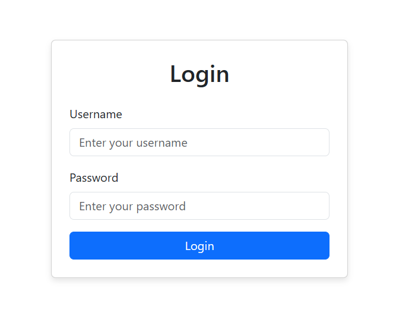
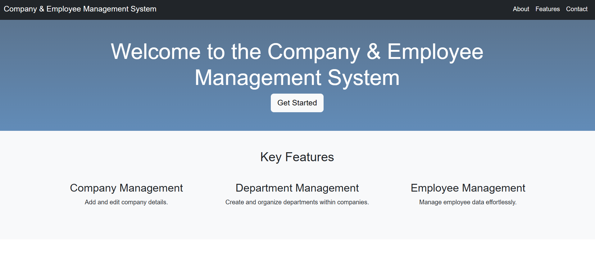
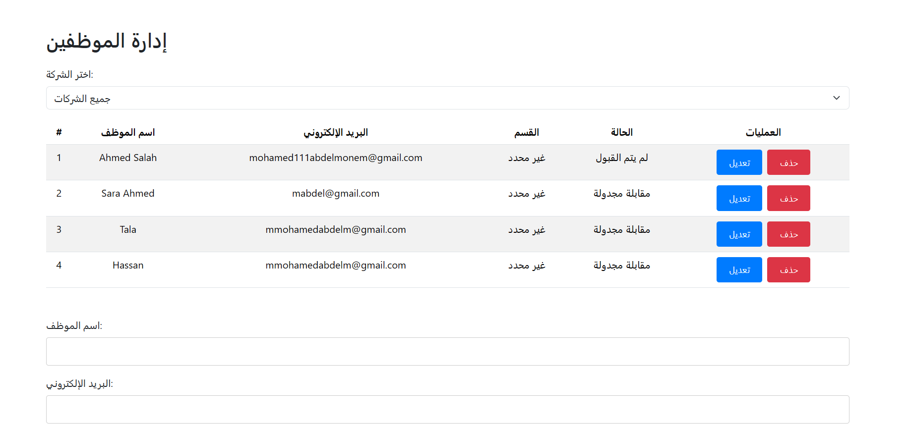
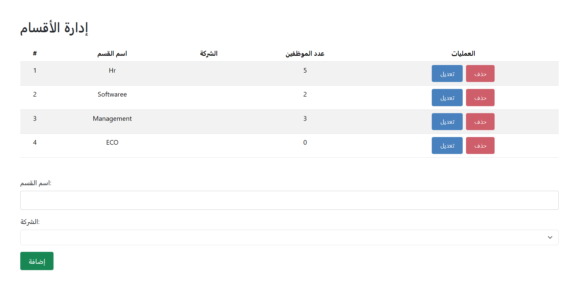
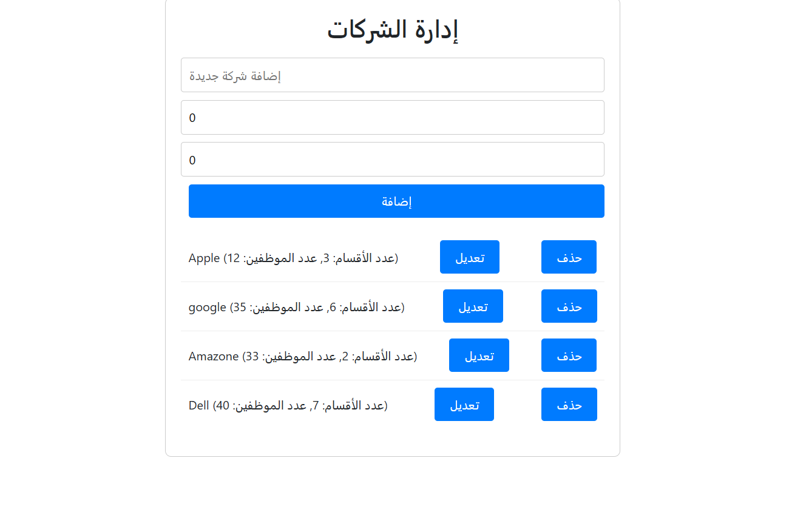

---

# Employee Management System

## Overview
This repository contains the implementation of an Employee Management System (EMS) designed to manage companies, departments, and employees. The system includes features for CRUD operations, role-based access control, secure authentication, and optional bonus functionalities like employee onboarding workflows and reporting.

The backend is built using Django REST Framework, while the frontend uses Vue.js. The application adheres to RESTful API conventions and ensures data security through proper validation and error handling.


---

## Comprehensive Documentation

### Approach
The Employee Management System was developed following a modular and scalable architecture. The backend leverages Django REST Framework for building robust APIs, while the frontend utilizes Vue.js for creating a responsive and user-friendly interface. Key considerations during development included:
- **Separation of Concerns**: Backend and frontend are decoupled to allow independent scaling and maintenance.
- **RESTful Design**: API endpoints follow REST principles for consistency and ease of use.
- **Role-Based Access Control (RBAC)**: Ensures only authorized users can perform specific actions based on their roles.
- **Validation and Error Handling**: Input validation and comprehensive error messages improve data integrity and user experience.

### Implementation Details
- **Backend**:
  - Models: Defined in `models.py` with relationships between entities (Company → Department → Employee).
  - Serializers: Used to convert model instances into JSON format for API responses.
  - Views: Implemented as class-based views following RESTful conventions.
  - Permissions: Custom permission classes enforce RBAC.
- **Frontend**:
  - Components: Modularized Vue components for reusability and maintainability.
  - State Management: Vuex for managing global state across the application.
  - Routing: Vue Router for navigating between pages.
  - API Integration: Axios for making HTTP requests to the backend API.

---

## Setup Instructions

### Prerequisites
- Python 3.12+
- DRF
- Node.js 
- SQLite


### Backend Setup
1. Clone the repository:
   ```bash
   git clone https://github.com/Mohamed00Abdelmonem/Dj-Vue-Task-BrainWise.git
   cd Dj-Vue-Task-BrainWise/backend
   ```
2. Install dependencies:
   ```bash
   pip install -r requirements.txt
   ```
3. Set up the database:
   ```bash
   python manage.py migrate
   ```
4. Create a superuser (for admin access):
   ```bash
   python manage.py createsuperuser
   ```
5. Run the server:
   ```bash
   python manage.py runserver
   ```

### Frontend Setup
1. Navigate to the frontend directory:
   ```bash
   cd Dj-Vue-Task-BrainWise/frontend
   ```
2. Install dependencies:
   ```bash
   npm install
   ```
3. Start the development server:
   ```bash
   npm run serve
   ```

### Environment Variables
Copy `.env.example` to `.env` and configure the necessary settings (e.g., database credentials, API keys).

---

## Task Completion Checklist

| Feature                          | Status       | Notes                                                                 |
|----------------------------------|--------------|----------------------------------------------------------------------|
| Backend Models                   | Completed    | All models implemented with required fields.                        |
| Validations & Business Logic     | Completed    | Email, mobile validation; auto-calculations for counts and durations.|
| Role-Based Access Control        | Completed    | Admin, Manager, Employee roles defined.                             |
| RESTful API                      | Completed    | CRUD operations for all entities.                                   |
| Frontend UI                      | Completed    | Includes login, company, department, and employee management pages. |
| Authentication                   | Completed    | Secure login mechanism integrated.                                  |
                     |

---

## Security Measures

### Authentication
- **JWT-Based Token Authentication**: Secure API endpoints by requiring valid tokens for access.
- **Token Expiry**: Tokens expire after a predefined time to enhance security.

### Authorization
- **Role-Based Access Control (RBAC)**: 
  - Admin: Full access to all features.
  - Manager: Can manage companies, departments, and employees but cannot modify system settings.
  - Employee: Can only view their own details and update personal information.

### Data Protection
- Sensitive information (e.g., passwords) is stored securely using hashing algorithms.
- Logs do not expose sensitive user data.

---

## API Documentation

### Accessing API Documentation
The API documentation is available at:
```
https://documenter.getpostman.com/view/28171269/2sAYdcrY2C
```

Alternatively, you can explore the API endpoints directly by running the backend server and accessing:
```
http://localhost:8000/api/
```

### API Endpoints

#### Company
- **GET `/api/companies/`**: Retrieve a list of all companies.
- **GET `/api/companies/{id}/`**: Retrieve details of a single company.
- **POST `/api/companies/`**: Create a new company.
- **PATCH `/api/companies/{id}/`**: Update an existing company.
- **DELETE `/api/companies/{id}/`**: Delete a company.

#### Department
- **GET `/api/departments/`**: Retrieve a list of all departments.
- **GET `/api/departments/{id}/`**: Retrieve details of a single department.
- **POST `/api/departments/`**: Create a new department.
- **PATCH `/api/departments/{id}/`**: Update an existing department.
- **DELETE `/api/departments/{id}/`**: Delete a department.

#### Employee
- **GET `/api/employees/`**: Retrieve a list of all employees.
- **GET `/api/employees/{id}/`**: Retrieve details of a single employee.
- **POST `/api/employees/`**: Create a new employee.
- **PATCH `/api/employees/{id}/`**: Update an existing employee.
- **DELETE `/api/employees/{id}/`**: Delete an employee.

---
#### Images 

#### Images

<div style="display: flex; justify-content: center; gap: 10px;">
  
  
  
  
  
</div>
